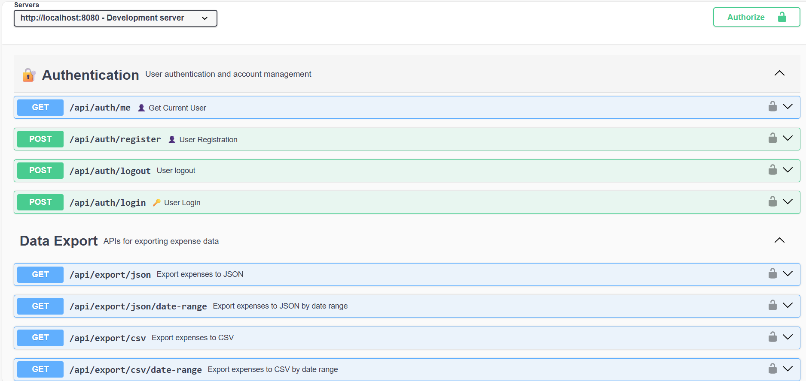
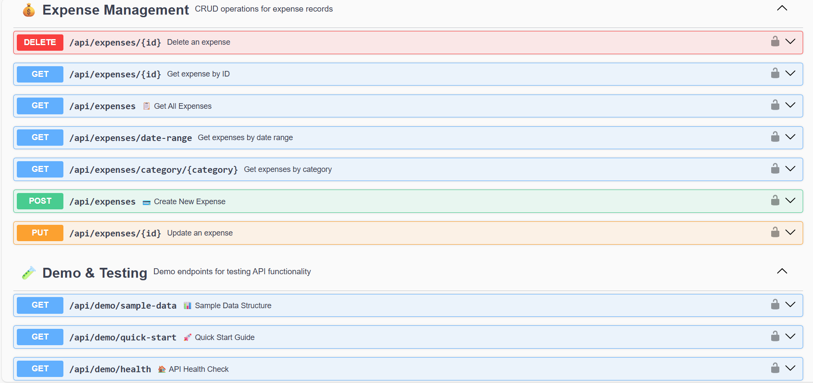
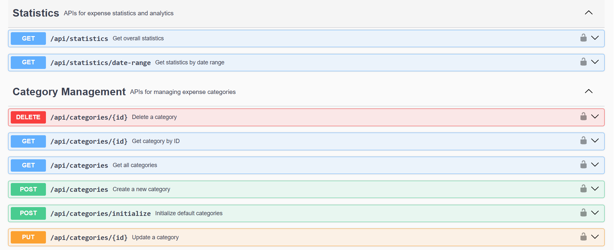
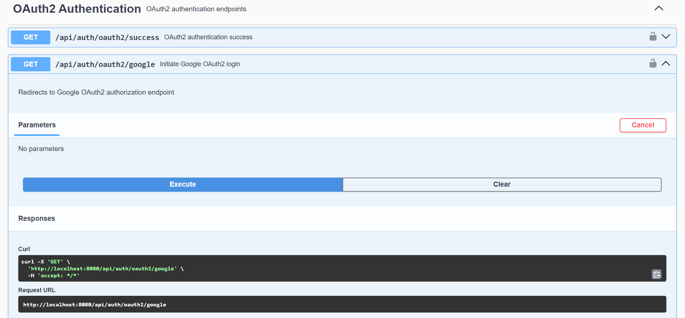

# 💰 Expense Tracker API

A comprehensive REST API for personal expense management with JWT authentication, OAuth2 Google integration, and Firebase Firestore backend.

## 🚀 Features

- **🔐 Dual Authentication**: JWT tokens + OAuth2 Google login
- **💳 Expense Management**: Full CRUD operations for expenses
- **🏷️ Category System**: Organize expenses by categories
- **📊 Analytics**: Monthly/yearly spending statistics
- **📤 Data Export**: CSV and JSON export functionality
- **☁️ Cloud Storage**: Firebase Firestore integration
- **📖 Interactive Documentation**: Complete Swagger UI interface

## 🛠️ Technology Stack

- **Backend**: Spring Boot 3.1.4
- **Language**: Java 17
- **Database**: Firebase Firestore (NoSQL)
- **Security**: Spring Security + JWT + OAuth2
- **Documentation**: OpenAPI 3.0 (Swagger)
- **Build Tool**: Gradle
- **Testing**: JUnit 5 + Mockito

## 📋 Prerequisites

- Java 17 or higher
- Gradle 7.0 or higher
- Firebase project with Firestore enabled
- Google Cloud Console project (for OAuth2)

## ⚙️ Environment Setup

1. **Clone the repository**
   ```bash
   git clone https://github.com/nguyenthephung/ExpenseTrackerAPI.git
   cd ExpenseTrackerAPI
   ```

2. **Configure environment variables**
   
   Create `.env` file in the root directory:
   ```env
   # Firebase Configuration
   FIREBASE_PROJECT_ID=your-firebase-project-id
   FIREBASE_CREDENTIALS_PATH=classpath:firebase-adminsdk.json
   
   # JWT Configuration
   JWT_SECRET=your-super-secret-jwt-key-here-make-it-long-and-secure
   JWT_EXPIRATION_MS=86400000
   
   # OAuth2 Google Configuration
   GOOGLE_CLIENT_ID=your-google-client-id
   GOOGLE_CLIENT_SECRET=your-google-client-secret
   GOOGLE_REDIRECT_URI=http://localhost:8080/login/oauth2/code/google
   
   # OAuth2 Redirect URIs
   OAUTH2_REDIRECT_URIS=http://localhost:3000/oauth2/redirect,http://localhost:8080/api/auth/oauth2/success
   
   # Server Configuration
   SERVER_PORT=8080
   ```

3. **Add Firebase Admin SDK**
   
   Download `firebase-adminsdk.json` from Firebase Console and place it in `app/src/main/resources/`

## 🚀 Running the Application

```bash
# Build the project
./gradlew clean build

# Run the application
./gradlew bootRun
```

The API will be available at: `http://localhost:8080`

## 📖 API Documentation & Testing with Swagger UI

### Access Swagger UI
Open your browser and navigate to: **http://localhost:8080/swagger-ui.html**

### 🔐 Authentication Flow

#### Option 1: JWT Authentication (Email/Password)

1. **Register a new account**
   - Navigate to **Authentication** section
   - Click on **POST /api/auth/register**
   - Click "Try it out"
   - Use this example payload:
   ```json
   {
     "email": "test@example.com",
     "password": "SecurePassword123!",
     "firstName": "John",
     "lastName": "Doe"
   }
   ```
   - Click "Execute"

2. **Login to get JWT token**
   - Click on **POST /api/auth/login**
   - Use these credentials:
   ```json
   {
     "email": "test@example.com",
     "password": "SecurePassword123!"
   }
   ```
   - Copy the `token` from the response

3. **Authorize requests**
   - Click the **🔒 Authorize** button at the top of Swagger UI
   - Enter: `Bearer YOUR_COPIED_TOKEN`
   - Click "Authorize"

#### Option 2: OAuth2 Google Authentication

1. **Initiate Google login**
   - Click on **GET /api/auth/oauth2/google**
   - Click "Try it out" → "Execute"
   - You'll be redirected to Google login
   - After successful login, you'll get a JWT token

2. **Use the token**
   - Copy the token from the redirect URL
   - Click **🔒 Authorize** in Swagger UI
   - Enter: `Bearer YOUR_TOKEN`

### 💳 Using Expense Management Features

After authentication, you can test all endpoints:

#### Create a Category First
```json
POST /api/categories
{
  "name": "Food & Dining",
  "description": "Restaurant meals and food purchases",
  "color": "#FF6B6B"
}
```

#### Create an Expense
```json
POST /api/expenses
{
  "description": "Lunch at Italian restaurant",
  "amount": 45.50,
  "categoryId": "your-category-id-here",
  "date": "2024-01-20T12:30:00"
}
```

#### Get Expense Statistics
```json
GET /api/statistics/monthly?year=2024&month=1
```

#### Export Data
```json
GET /api/export/csv?startDate=2024-01-01&endDate=2024-01-31
```

## 📊 API Endpoints Overview

### 🔐 Authentication
- `POST /api/auth/register` - Register new user
- `POST /api/auth/login` - Login with email/password
- `GET /api/auth/me` - Get current user profile
- `GET /api/auth/oauth2/google` - Google OAuth2 login

### 💰 Expense Management
- `GET /api/expenses` - Get all user expenses
- `POST /api/expenses` - Create new expense
- `GET /api/expenses/{id}` - Get expense by ID
- `PUT /api/expenses/{id}` - Update expense
- `DELETE /api/expenses/{id}` - Delete expense
- `GET /api/expenses/search` - Search expenses with filters

### 🏷️ Categories
- `GET /api/categories` - Get all categories
- `POST /api/categories` - Create new category
- `PUT /api/categories/{id}` - Update category
- `DELETE /api/categories/{id}` - Delete category

### 📊 Statistics & Analytics
- `GET /api/statistics/summary` - Overall spending summary
- `GET /api/statistics/monthly` - Monthly spending report
- `GET /api/statistics/yearly` - Yearly spending report
- `GET /api/statistics/by-category` - Spending by category

### 📤 Data Export
- `GET /api/export/csv` - Export data as CSV
- `GET /api/export/json` - Export data as JSON

## 🧪 Testing with Swagger UI

### Sample Test Scenarios

1. **Complete User Journey**
   ```
   Register → Login → Create Categories → Add Expenses → View Statistics → Export Data
   ```

2. **Expense Filtering**
   ```
   Create multiple expenses → Use search filters by date range, category, amount
   ```

3. **Analytics Testing**
   ```
   Add expenses across different months → Check monthly/yearly statistics
   ```

## 🔒 Security Features

- **JWT Token Authentication**: Secure stateless authentication
- **OAuth2 Google Integration**: Social login capability  
- **Password Encryption**: BCrypt password hashing
- **CORS Configuration**: Cross-origin request handling
- **Environment Variables**: Secure configuration management

## 🐛 Troubleshooting

### Common Issues

1. **Firebase Connection Error**
   - Verify `firebase-adminsdk.json` file is in the correct location
   - Check Firebase project ID in environment variables

2. **JWT Token Issues**
   - Ensure JWT secret is properly set in `.env`
   - Check token expiration time

3. **OAuth2 Google Login Problems**
   - Verify Google Client ID/Secret in `.env`
   - Check redirect URI configuration in Google Console

   ## 🖼️ Screenshots

   Below are screenshots of the application (Swagger UI and sample UI mockups). The images are in the `screenshot/` folder.

   

   

   

   

